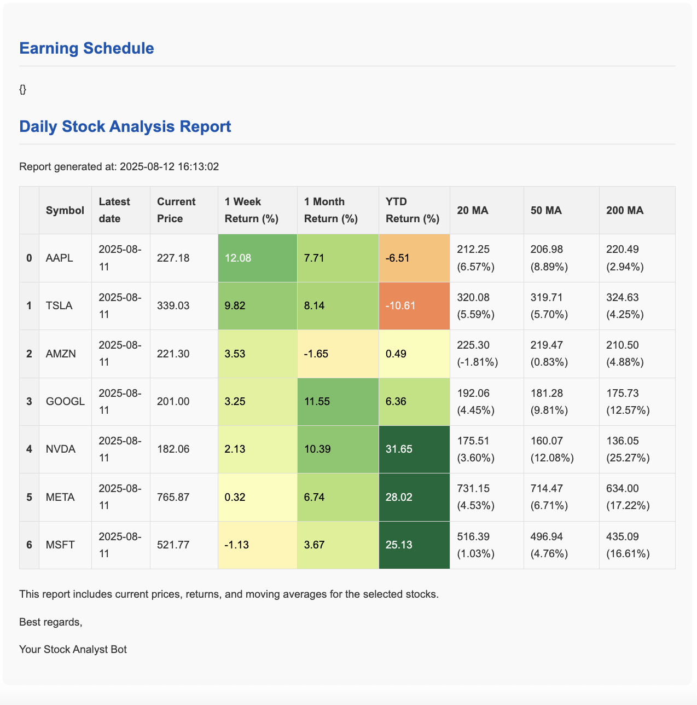

# Stock AI Agent

An automated stock analysis and reporting system that generates comprehensive stock reports and earnings call summaries. The system fetches real-time stock data, calculates technical indicators, and delivers insights via email.

## Features

- **Automated Stock Reports**: Generate detailed reports with moving averages, returns analysis, and price trends
- **Earnings Call Summaries**: AI-powered analysis of earnings call transcripts
- **Flexible Stock Selection**: Support for both predefined stock lists and dynamic Google Sheets integration
- **Email Delivery**: Automated report distribution to specified recipients
- **Technical Analysis**: Calculate 20, 50, and 200-day moving averages plus returns analysis
- **Real-time Data**: Fetch current stock prices using Yahoo Finance integration

## Sample Output

Here's an example of the generated stock report:



*The report includes current prices, moving averages, percentage returns, and technical analysis for each stock in your portfolio.*

## Architecture

The system consists of two main pipelines:

1. **Stock Report Pipeline** (`main.py`): Reads stock symbols from Google Sheets and generates comprehensive analysis
2. **Earnings Call Pipeline** (`earning_call_summary.py`): Analyzes earnings calls for predefined stock symbols

## Prerequisites

- Python 3.8+
- Google Cloud Service Account (for Sheets integration)
- Email account with app password (for report delivery)
- Google Generative AI API key (for earnings analysis)

## Installation

1. **Clone the repository**:
   ```bash
   git clone <repository-url>
   cd stock_ai_agent
   ```

2. **Install dependencies using uv**:
   ```bash
   uv sync
   ```

3. **Activate the virtual environment**:
   ```bash
   source .venv/bin/activate
   ```

## Configuration

### 1. Environment Variables

Copy the example environment file and configure your settings:

```bash
cp .env.example .env
```

Edit `.env` with your configuration:

```bash
# Email configuration for sending stock reports
SENDER_EMAIL="your.email@gmail.com"
SENDER_PASSWORD="your_app_password"  # Use app password, not regular password
SMTP_SERVER="smtp.gmail.com"
SMTP_PORT=587

# Report recipients (comma-separated)
RECIPIENT_EMAILS="recipient1@email.com,recipient2@email.com"

# API keys
GOOGLE_API_KEY="your_google_ai_api_key"

# Google Sheets integration
STOCK_NAME_SPREADSHEET_ID="your_google_sheet_id"
```

### 2. Google Service Account

For Google Sheets integration, you need a service account:

1. Create a Google Cloud Project
2. Enable the Google Sheets API
3. Create a service account and download the JSON key
4. Save the key as `.google_sheet_api.json` in the project root
5. Share your Google Sheet with the service account email

### 3. Stock Configuration

**Option 1: Use Google Sheets**
- Create a Google Sheet with a "name" column containing stock symbols
- Set the `STOCK_NAME_SPREADSHEET_ID` in your `.env` file

**Option 2: Use Predefined List** (for `earning_call_summary.py`)
- Edit `stock_agent_python/constants.py` to modify the `STOCK_SYMBOLS` list

## Usage

### Generate Stock Reports

Run the main stock analysis pipeline:

```bash
./run.sh
```

Or manually:

```bash
source .venv/bin/activate && python send_report.py
```

This will:
- Read stock symbols from your configured Google Sheet
- Fetch historical data for each symbol
- Calculate moving averages (20, 50, 200 days)
- Calculate returns (1 week, 1 month, YTD)
- Generate and email comprehensive reports

### Generate Earnings Call Summaries

Run the earnings analysis pipeline:

```bash
./run_earning_call_summary.sh
```

Or manually:

```bash
source .venv/bin/activate
python earning_call_summary.py
```

This will:
- Analyze earnings calls for predefined stock symbols
- Generate AI-powered summaries
- Email the analysis results

## Project Structure

```
stock_ai_agent/
├── run_report.py                     # Main stock report pipeline
├── earning_call_summary.py           # Earnings call analysis pipeline
├── run.sh                           # Stock report execution script
├── run_earning_call_summary.sh      # Earnings analysis script
├── .env.example                     # Environment configuration template
├── pyproject.toml                   # Project dependencies
└── stock_agent_python/              # Core package
    ├── constants.py                 # Configuration constants
    ├── get_stock_price.py          # Yahoo Finance data fetching
    ├── make_stock_report.py        # Core analysis logic
    ├── read_google_sheet.py        # Google Sheets integration
    ├── send_stock_report_email.py  # Stock report email sender
    ├── send_earning_call_summary_report.py  # Earnings email sender
    └── utils.py                    # Utility functions
```

## Technical Details

### Stock Analysis Features

- **Moving Averages**: 20, 50, and 200-day moving averages with percentage deviation from current price
- **Returns Analysis**: 1-week, 1-month, and year-to-date returns
- **Data Source**: Yahoo Finance via `yahoo_fin` library
- **Error Handling**: Robust error handling for missing data or API issues

### Email Reports

- HTML-formatted reports with tables and charts
- Support for multiple recipients
- Configurable SMTP settings for various email providers
- Template-based report generation using Jinja2

## Development

### Code Quality

Pre-commit hooks are configured for code quality:

```bash
pre-commit install
```

The hooks include:
- Trailing whitespace removal
- End-of-file fixing
- YAML validation
- Large file checks

### Adding New Features

1. Follow the existing code structure in `stock_agent_python/`
2. Add new constants to `constants.py`
3. Use the existing logging setup with `loguru`
4. Follow the established error handling patterns

## Troubleshooting

### Common Issues

1. **Google Sheets Access**: Ensure the service account has access to your sheet
2. **Email Authentication**: Use app passwords, not regular passwords for Gmail
3. **API Rate Limits**: Yahoo Finance may have rate limits; the system includes retry logic
4. **Missing Data**: Some stocks may not have sufficient historical data for all calculations

### Logging

The system uses `loguru` for logging. Check console output for detailed error messages and execution status.

## License

[Add your license information here]

## Contributing

[Add contribution guidelines here]